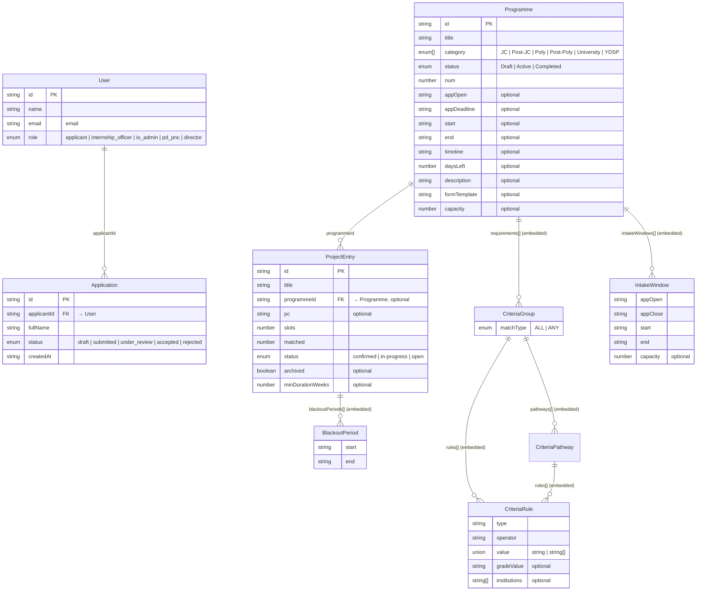

# Data model (ER diagram)

The store is a file-backed DAL, not a SQL database — each "table" is a zod schema in
[app/data/repositories/](../app/data/repositories/). **This file is generated** from
those schemas by [scripts/generate-erd.ts](../scripts/generate-erd.ts); don't edit the
diagram by hand — run `npm run db:erd` after changing a schema.

> Renders in VSCode's markdown preview, on GitHub, and at <https://mermaid.live>. It's
> plain text, so there's no runtime dependency and nothing that touches the air-gap rule.

## Entities and relationships

Solid lines with the crow's-foot (`o{`) are one-to-many; `||` is one-to-one. FK lines
join stored collections; the rest are embedded value objects (nested JSON in a parent).

<!-- ERD:START (generated by scripts/generate-erd.ts — run `npm run db:erd`) -->

<!-- ERD:END -->

## Notes

- **`programmeId` and `pc` are soft links.** They're plain `string` ids with no
  referential integrity enforced by the store — the relationship is by convention.
- **`pc` (Programme Centre) is a string today**, not its own entity. The PC models
  are deliberately deferred — see the header comment in
  [projects.ts](../app/data/repositories/projects.ts).
- **Users carry the role; the policy is code.** What each role *may do* lives in
  [access/permissions.ts](../app/data/access/permissions.ts), not in the data.
- The embedded value objects are drawn as separate boxes for clarity — they
  serialise as nested arrays inside their parent record's JSON.
